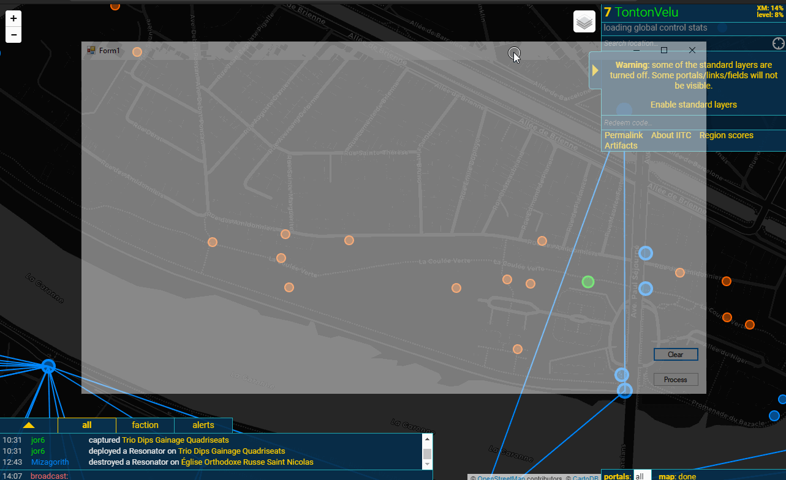

# IngressFielder

pour utiliser l'outil, telechargez et exécutez le fichier bin\Debug\Fielder.exe 

# comment ça marche ?

- Lancez l'intel map https://intel.ingress.com/intel avec votre navigateur internet favori.
- Lancez Fielder.exe, ça va ouvrir une fenêtre transparente qu'on peut superposer à l'intel map.
- avec la souris, cliquez sur les portails à travers la fenêtre transparente.
- cliquez sur le bouton "Process" pour calculer les fields.

# Notes

- le bouton "Clear" efface tous les portails/fields
- le texte sous chaque portail indique son numéro et le nombre de clefs nécessaires pour faire le field. 

